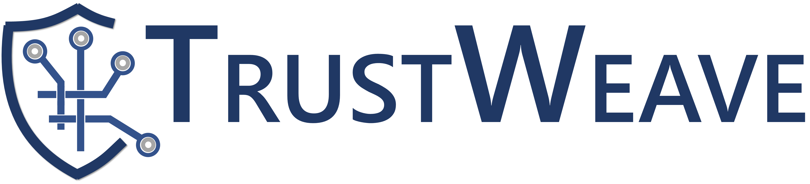

  

# **TrustWeave**
### *Guidelines for Integrating Trustable Digital Components into Cybersecurity Certification Schemes*

---

## **About TrustWeave**

**TrustWeave** is an open initiative developing practical guidelines for integrating **Trustable Digital Components (TDCs)** into European and international cybersecurity certification frameworks.

TDCs include elements such as TEEs, Secure Elements, HSMs, cryptographic identity modules, secure storage controllers, and attestation-enabled accelerators. These components offer hardware-anchored identity, measurement, attestation, provenance, and lifecycle controls—capabilities increasingly relevant to certification schemes.

The project aims to align technical assurance practices with policy objectives (e.g., EUCC, CSA, NIS2, CRA) by providing structured ways to reason about trust in complex digital systems. TrustWeave considers how trust is **composed, inherited, and validated** across systems ranging from embedded devices to cloud platforms and HPC infrastructures.

The initiative is collaborative and evolving, with the long-term goal of maturing into a publicly governed and standards-compatible framework.

---

## **Why TrustWeave?**

Modern infrastructures depend on heterogeneous components interacting across supply chains and lifecycle stages. Their security depends not only on each component’s assurance level, but also on **how these assurances combine**, a dimension not fully captured in current certification approaches.

TrustWeave focuses on this trust-composition challenge, exploring how evidence from different layers (attestations, measurements, provenance, SBOM/OBOM data, lifecycle metadata) can be structured and related to complement existing certification schemes.

---

## **What the Guidelines Aim for**

TrustWeave aim to introduce models and methods intended to work *with*, not replace, cybersecurity frameworks:

- **Structured Assurance Model**  
  A three-layer view (Component, System, Product/Service) aligned with principles in EUCC, CRA, and related schemes.

- **TDC-Oriented Taxonomy**  
  Clear categories and definitions for hardware, firmware, and software trust anchors.

- **Unified Evaluation Methodology**  
  Covering component identification, lifecycle-aware threat modeling, evidence collection, security-level mapping, and guidance for qualification or certification.

- **Evidence Specifications**  
  Emphasizing machine-verifiable artifacts such as attestation reports, signed boot logs, provenance and manufacturing data, SBOM/OBOM structures, and other trust signals.

- **Interoperability Considerations**  
  High-level mapping principles aligned with existing standards (IEC 62443, ISO 27001, SLSA, PSA Certified, NIST SP 1800-34, etc.).

- **Sector-Specific Overlays**  
  Optional profiles for cloud, industrial automation, telecom, HPC, healthcare, and other domains.

These elements aim to provide a coherent way to describe, evaluate, and reuse trust evidence across systems and across certification schemes.

---

## **Status & Participation**

**TrustWeave is currently a work in progress.**  
TrustWeave was originally born in the framework of WP4 "Trust, Security, and Privacy in HPC" in Spoke 1 - _Future HPC_ of the _High-Performance Computing, Big Data e Quantum Computing Research Centre_, created and managed by the [ICSC](https://www.supercomputing-icsc.it/) foundation and funded by the Italian National Recovery and Resilience Plan (NRRP).
A draft of the guidelines is under development in a private repository with contributions from experts in industry, academia, and public bodies.

We welcome participation from:

- hardware and semiconductor architects  
- firmware and embedded systems engineers  
- cloud and infrastructure security specialists  
- certification and conformity-assessment experts  
- researchers in trusted computing and supply-chain security  
- policymakers and standardization bodies  

Our goal is to co-develop a practical, technically grounded methodology supporting vendors, integrators, auditors, and regulators.

---

## **Get Involved**

If you are interested in contributing or reviewing the work:

**GitHub:** Open an issue on the TrustWeave GitHub organization page.

---

*TrustWeave — Building a clearer path for integrating trusted components into cybersecurity assurance.*
